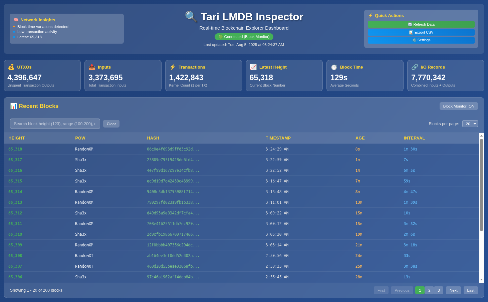

# Tari LMDB Inspector

> ⚠️ **Work in Progress** - This tool is experimental and under active development. Use with caution in production environments.

A powerful, multi-interface tool for exploring and debugging Tari blockchain data stored in LMDB databases. Designed for developers, node operators, and blockchain enthusiasts who need deep insights into Tari's blockchain data structure and storage.

## 📸 Dashboard Preview



*Professional web dashboard with real-time blockchain monitoring, comprehensive statistics, and interactive block explorer*

## ✨ Features

- **🖥️ CLI Mode**: Query blocks, transactions, and ranges via command-line interface
- **📊 TUI Mode**: Interactive terminal dashboard with real-time blockchain monitoring
- **🌐 Web Mode**: Professional browser dashboard with WebSocket updates and REST API
- **🔍 Key Inspection Mode**: Debug LMDB key structures and data linking mechanisms
- **📈 Flexible Access**: Works with any Tari LMDB database, with demo data fallback
- **⚡ Real-time Updates**: Live blockchain monitoring and statistics
- **🔗 REST API**: Programmatic access to blockchain data

## 📋 Table of Contents

- [Installation](#installation)
- [Quick Start](#quick-start)
- [Interface Modes](#interface-modes)
- [API Reference](#api-reference)
- [Database Structure](#database-structure)
- [For Node Operators](#for-node-operators)
- [Contributing](#contributing)

## 🚀 Installation

### Prerequisites

- **Rust**: Install via [rustup](https://rustup.rs/)
- **Tari Database**: Valid Tari mainnet LMDB database (typically `~/.tari/mainnet/data/base_node/db`)
- **Optional**: `jq` for JSON parsing (`sudo apt install jq` on Ubuntu/Debian)

### Build from Source

```bash
git clone https://github.com/OIEIEIO/tari-lmdb-inspector.git
cd tari-lmdb-inspector
cargo build --release
```

The executable will be available at `target/release/tari-lmdb-inspector`.

> **Note**: You can use `cargo run` for development or `cargo run --release` for optimized builds.

## ⚡ Quick Start

```bash
# Launch web dashboard (recommended for new users)
cargo run -- -d ~/.tari/mainnet/data/base_node/db web --port 8080

cargo run -- -d ~/.tari/esmeralda/data/base_node/db web --port 8080

# Open browser to http://localhost:8080
```

All commands require specifying the database path with `-d` or `--database`:

```bash
cargo run -- -d ~/.tari/mainnet/data/base_node/db <MODE> [OPTIONS]
```

## 🎯 Interface Modes

### 🌐 Web Mode (Recommended)

Professional browser-based dashboard with real-time monitoring and REST API.

```bash
# Start web server (default port 8080)
cargo run -- -d ~/.tari/mainnet/data/base_node/db web --port 8080

# Start on different port
cargo run -- -d ~/.tari/mainnet/data/base_node/db web --port 3000

# Enable CORS for development
cargo run -- -d ~/.tari/mainnet/data/base_node/db web --port 8080 --cors

# Bind to specific address
cargo run -- -d ~/.tari/mainnet/data/base_node/db web --port 8080 --bind 0.0.0.0
```

**Features:**
- 📊 Real-time blockchain statistics dashboard
- 🔍 Interactive block explorer with search
- 📈 Network insights and transaction monitoring
- ⚡ WebSocket live updates
- 🔗 REST API for programmatic access

**Access:** http://localhost:8080

### 🖥️ CLI Mode

Direct terminal interface for block and transaction queries.

```bash
# View specific block details
cargo run -- -d ~/.tari/mainnet/data/base_node/db cli --detail 64754

# Show last few blocks (default 3)
cargo run -- -d ~/.tari/mainnet/data/base_node/db cli

# Show last 5 blocks
cargo run -- -d ~/.tari/mainnet/data/base_node/db cli --count 5

# Query block range
cargo run -- -d ~/.tari/mainnet/data/base_node/db cli --range 64750-64754

# Show specific block height
cargo run -- -d ~/.tari/mainnet/data/base_node/db cli --block 64754
```

### 📊 TUI Mode

Interactive terminal dashboard with real-time monitoring.

```bash
# Launch TUI dashboard (default 5-second refresh)
cargo run -- -d ~/.tari/mainnet/data/base_node/db tui

# Launch with custom refresh interval
cargo run -- -d ~/.tari/mainnet/data/base_node/db tui --refresh 10
```

**Controls:**
- `q` or `Esc`: Quit
- `r`: Force refresh

### 🔍 Key Inspection Mode

Debug and analyze LMDB key structures and data relationships.

```bash
# Basic investigation (runs comprehensive analysis)
cargo run -- -d ~/.tari/mainnet/data/base_node/db inspect

# Simple prefix test for linking theory
cargo run -- -d ~/.tari/mainnet/data/base_node/db inspect --simple-test --block-height 64754

# Comprehensive key investigation
cargo run -- -d ~/.tari/mainnet/data/base_node/db inspect --thorough --block-height 64754

# Inspect all table structures
cargo run -- -d ~/.tari/mainnet/data/base_node/db inspect --all-tables

# Test pattern across multiple blocks
cargo run -- -d ~/.tari/mainnet/data/base_node/db inspect --test-patterns
```

## 🔗 API Reference

### REST Endpoints

- `GET /api/block/<height>` - Get block details
- `GET /api/blocks/range?start=X&end=Y` - Get block range (max 1000)
- `GET /api/dashboard` - Dashboard data
- `ws://localhost:8080/ws` - WebSocket for real-time updates

### Example Usage

```bash
# Get specific block
curl -s http://localhost:8080/api/block/64754 | jq

# Get block range
curl -s "http://localhost:8080/api/blocks/range?start=64750&end=64754" | jq

# Get dashboard data
curl -s http://localhost:8080/api/dashboard | jq
```

## 📊 Database Structure

The tool analyzes Tari's LMDB database containing the following tables:

| Table Name | Entries | Description |
|------------|---------|-------------|
| `headers` | 64,823 | Block headers with metadata |
| `kernels` | 1,416,107 | Transaction kernels (fees, signatures) |
| `utxos` | 4,377,143 | Unspent transaction outputs |
| `inputs` | 3,357,980 | Transaction inputs (spent outputs) |
| `block_hashes` | 64,823 | Block hash → height mapping |
| `kernel_excess_index` | 1,416,107 | Kernel excess → block mapping |
| `txos_hash_to_index` | 4,377,143 | Output hash → index mapping |
| `deleted_txo_hash_to_header_index` | 3,357,980 | Spent output → block mapping |
| `header_accumulated_data` | 64,823 | Accumulated blockchain data |
| `jmt_node_data` | 30,360,201 | Jellyfish Merkle Tree nodes |
| `jmt_unique_key_data` | 7,734,870 | JMT unique keys |
| `jmt_value_data` | 7,734,870 | JMT values |
| `mmr_peak_data` | 64,823 | Merkle Mountain Range peaks |
| `payref_to_output_index` | 4,377,143 | Payment reference mappings |

*Table sizes based on sample mainnet database*

## 🔧 For Node Operators

This tool helps Tari node operators:

- **Monitor Health**: Real-time blockchain monitoring via professional web dashboard
- **Debug Issues**: Inspect specific blocks, transactions, and data inconsistencies
- **Optimize Performance**: Analyze LMDB key structures and access patterns
- **Verify Integrity**: Check table sizes, relationships, and data consistency
- **Troubleshoot**: Deep-dive into transaction linking and storage mechanisms
- **API Integration**: Programmatic access to blockchain data via REST API

## 🤝 Contributing

We welcome contributions! This is an experimental tool under active development.

1. Fork the repository
2. Create a feature branch: `git checkout -b feature/your-feature`
3. Commit changes: `git commit -m "Add your feature"`
4. Push to branch: `git push origin feature/your-feature`
5. Open a pull request

Please ensure code follows Rust best practices and includes tests where applicable.

## ⚠️ Important Notes

- **Experimental Status**: This tool is work-in-progress and may have bugs
- **Database Safety**: Uses read-only access to LMDB databases
- **Performance**: Large databases may require significant memory and processing time
- **Compatibility**: Designed for Tari mainnet LMDB format

## 📄 License

This project is licensed under the MIT License.

## 🙏 Acknowledgments

- Built with Rust ecosystem: `axum`, `ratatui`, `lmdb-zero`
- Inspired by the Tari community's need for robust blockchain debugging tools
- Special thanks to the Tari development team for creating an accessible blockchain platform

---

*For issues, feature requests, or questions, please open an issue on GitHub.*
